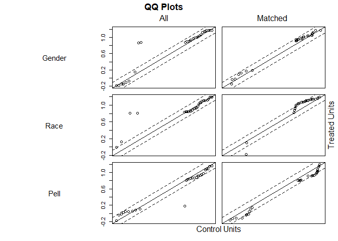

Introduction
------------

In fall 2016, Clark Atlanta University (CAU) evaluated student
performance in lower-division courses in Academic Year (AY) 2012/13 to
AY 2015/16; this review was then expanded to include AY 2016/17. There
were high failure rates among students in 52.8% of these courses, which
led to a review of courses in STEM. Foundational STEM courses include
General Biology I & II, General Chemistry I & II; Programing Principles
I; Calculus I, II, and III; and General and Modern Physics, and
Mechanics. From this data, we noticed that approximately 30% of our STEM
majors are earning a C in foundational STEM courses. We did not find
this result acceptable and hope to provide resources to remedy this
issue. Since mathematics is foundational for STEM courses, we aimed our
Course Redesign with Technology (CRT) effort at improving student
mastery of concepts in Calculus I.

A course redesign with the use of adaptive learning courseware began
spring 2018 in the Department of Mathematical Sciences. The goal of the
effort was to improve students’ mastery and the use of mathematical
concepts through course redesign, assessment, and implementation using
adaptive learning courseware which will enhance student mastery of
learning outcomes, retention, and persistence rates in the undergraduate
STEM degree programs at CAU. Calculus I was the selected course involved
in the redesign and students occupied four sections of this course.
Students in the course were divided into two groups. One section of the
course was exposed (treatment group) to the intervention, the use of
adaptive learning courseware, while the other students learned Calculus
with previous teaching methods (control group). The courseware piloted
in this course is Assessment and LEarning in Knowledge Spaces (ALEKS).
The course product used was “Prep for Calculus,” a course that is
designed to help students to develop the prerequisite foundation needed
to learn Calculus I. We employ this product as a corequisite to support
the Calculus I course.

The goal of this project is to determine the effectiveness of the
intervention. After several meetings with my mentor, Dhiraj Khanna and
learning the intricacies of the R ecosystem, I have decided to use
propensity score matching to determine the effectiveness of the
intervention. This statistical technique matches a treatment case with
one or more control cases based on the propensity score. The propensity
score is determined by the attributes that the observations have in
common. A recommendation from my mentor was to include cognitive and
non-cognitive variables in the study. The variables used are listed
below:

Instructor - the person that taught the class Major - the student’s
major area of study Grade - the letter grade that the student earned in
the course Gender - the student’s self reported gender male = 1, female
=0 Race - Black =1, Others = 0 1st Generation - The students that are
the first to attend college. First = 0, Not the First to Attend College
= 1 Score - The numeric grade that corresponds to the letter grade
(90=A, 80=B, 70=C, 60=D, 50=F). Treatment - Determines the student
group. Treatment =1, Control =0 Pell - The student is eligible to
receive a grant from the federal government. Yes =1, No =0 Standardized
Score - The standardized z-score for numeric grades.

The necessary libraries needed for the project has been installed and
are loaded here.

``` r
library(tidyverse) #The swiss knife!
#library(haven)
#library(sjmisc)
#library(plyr)
library(MatchIt)
#library(ggplot2)
#library(caret)
#library(RCurl) #To read the csv file from GitHub directly
library(rmarkdown)
```

All of the packages are loaded. Therefore, we load the data into R and
call the data frame dta.

``` r
dta <- read.csv("dta.csv")
```

An extra variable was included in the data frame after the data was
read. Thus, the variable was removed.

``` r
#dta<-select(dta, -c(X))
```

Data Wrangling
--------------

The data set was provided in a nearly cleaned manner. However, multiple
data wrangling techniques were performed on the data frame to transom it
into a document that can be analyzed. These techniques include removing
unnecessary variables, changing the names of some columns, adding
variables, and including functions for calculation.

Removing Unnecessary Variables: The original data frame included 19
variables. Some of the variables were not necessary to perform
propensity score matching as they did not provide relevant information
for the matching algorithm. Removing the variables reduced the data
frame to 9 variables. Some of the variables are still irrelevant but it
is necessary to map the data back to specific observations. Therefore,
the data frame does include more variables that will be used in the
analysis.

Changing Columns Names: There are ten variables included in the data
frame, and all variables underwent a name change. When the data was
imported into R Studio, some variables names were too long, and others
did not accurately describe the particular data. Therefore, the names of
the variables were changed to shorter, concise names that accurately
describe the data in the column.

Adding Variables and Data: Two variables were necessary for building the
model. A treatment column and a column that displayed standardized z
scores for the final grade earned. In the treatment column, an if-else
statement was written to place a 1 for the observation that was treated
and a 0 otherwise. This information helped to accurately and easily
determine the control and treatment groups.

Standardized z-score: In the standardized z-score column, a function was
written to include a standardized score for each observation in the
“Score” column of the data frame. This standardized z-score normalizes
the data and has a mean of 0 and a standard deviation of 1. It
represents the signed fractional number of standard deviations by which
the value of an observation or data point lies above or below the mean
value of the data set that is measured. Values above the mean have
positive standard scores, while values below the mean have negative
standard scores. Adding this column increased the data frame to 10
variables.

Exploratory Data Analysis
-------------------------

Now that the data have been ingested it is time to begin the
exploration. The first thing to do is to have a quick look at our data.
For that, the `str()` function and the more human-readable (and
intuitive), `glimpse()` function. is used.

``` r
glimpse(dta)
```

    ## Observations: 332
    ## Variables: 11
    ## $ X               <int> 1, 2, 3, 4, 5, 6, 7, 8, 9, 10, 11, 12, 13, 14,...
    ## $ Instructor      <fct> "Kebede, Temesgen", "Whelchel, Noel", "Whelche...
    ## $ Major           <fct> Biology, Biology, Computer Science, Computer a...
    ## $ Grade           <fct> A, A, B, F, D, A, C, B, B, B, A, B, D, C, A, C...
    ## $ Gender          <int> 1, 1, 0, 0, 0, 0, 0, 1, 1, 1, 1, 1, 1, 1, 1, 1...
    ## $ Race            <int> 0, 0, 0, 0, 0, 0, 0, 1, 1, 1, 1, 1, 1, 1, 1, 1...
    ## $ Pell            <int> 0, 0, 0, 0, 0, 0, 0, 0, 0, 0, 0, 0, 0, 0, 0, 0...
    ## $ X1st.Generation <int> 0, 0, 0, 0, 0, 0, 0, 0, 0, 0, 0, 0, 0, 0, 0, 0...
    ## $ Score           <int> 90, 90, 80, 50, 60, 90, 70, 80, 80, 80, 90, 80...
    ## $ Treatment       <int> 0, 0, 0, 0, 0, 0, 0, 0, 0, 0, 0, 0, 0, 0, 0, 0...
    ## $ Std_Score       <dbl> 1.1725667, 1.1725667, 0.4489754, -1.7217987, -...

As expected, there are 332 rows with 10 variables inside of the data
set. Additionally, the type of variables is apparent from this view. For
example, Major\` is a character variable. It may be more beneficial to
change the treatment variable from a number to a factor since it
determines whether a student received the treatment or not. A factor,
instead of a number seems more logical in this case. Necessary changes
will be made to the variable if the exploratory analysis dictates. For
now, we proceed with the intended analysis. Now let’s take a look of the
structure of the data set to see what additional information is
available.

``` r
str(dta)
```

    ## 'data.frame':    332 obs. of  11 variables:
    ##  $ X              : int  1 2 3 4 5 6 7 8 9 10 ...
    ##  $ Instructor     : Factor w/ 9 levels "Djire, Bakary",..: 5 9 9 5 1 1 3 1 8 6 ...
    ##  $ Major          : Factor w/ 20 levels "Accounting","Biology",..: 2 2 7 6 6 6 5 18 2 19 ...
    ##  $ Grade          : Factor w/ 5 levels "A","B","C","D",..: 1 1 2 5 4 1 3 2 2 2 ...
    ##  $ Gender         : int  1 1 0 0 0 0 0 1 1 1 ...
    ##  $ Race           : int  0 0 0 0 0 0 0 1 1 1 ...
    ##  $ Pell           : int  0 0 0 0 0 0 0 0 0 0 ...
    ##  $ X1st.Generation: int  0 0 0 0 0 0 0 0 0 0 ...
    ##  $ Score          : int  90 90 80 50 60 90 70 80 80 80 ...
    ##  $ Treatment      : int  0 0 0 0 0 0 0 0 0 0 ...
    ##  $ Std_Score      : num  1.173 1.173 0.449 -1.722 -0.998 ...

Evaluating the output for each code, it is easy to determine that the
codes provide almost identical information.

Since propensity score matching aim is to group the data, the most
apparent grouping of students., their major.

``` r
library(tidyverse)
dta %>% group_by(Major) %>% count() %>% arrange(desc(n))
```

    ## # A tibble: 20 x 2
    ## # Groups:   Major [20]
    ##    Major                             n
    ##    <fct>                         <int>
    ##  1 Biology                         160
    ##  2 Computer Science                 40
    ##  3 Computer and Information Sys     29
    ##  4 Business Administration          25
    ##  5 Dual Deg Engineer - Physics      15
    ##  6 Chemistry                        13
    ##  7 Dual Deg Engineer- Comp Sci       9
    ##  8 Dual Deg Engineer - Chemistry     7
    ##  9 Psychology - BS Degree            7
    ## 10 Psychology                        6
    ## 11 Biology - Public Health           4
    ## 12 Accounting                        3
    ## 13 General Studies                   3
    ## 14 Criminal Justice Admin            2
    ## 15 Dual Degree-Biology               2
    ## 16 Mass Media Arts                   2
    ## 17 Mathematics                       2
    ## 18 Early Childhood Education         1
    ## 19 English                           1
    ## 20 Social Work                       1

The major with the largest number of students is Biology. This number is
typical as the majority of STEM majors want to become doctors. Now
consider those majors where the count is greater than five. Call this
data frame major\_count and print it to the console.

``` r
major_count <- dta %>% group_by(Major) %>% count() %>% filter(n > 5)
major_count
```

    ## # A tibble: 10 x 2
    ## # Groups:   Major [10]
    ##    Major                             n
    ##    <fct>                         <int>
    ##  1 Biology                         160
    ##  2 Business Administration          25
    ##  3 Chemistry                        13
    ##  4 Computer and Information Sys     29
    ##  5 Computer Science                 40
    ##  6 Dual Deg Engineer- Comp Sci       9
    ##  7 Dual Deg Engineer - Chemistry     7
    ##  8 Dual Deg Engineer - Physics      15
    ##  9 Psychology                        6
    ## 10 Psychology - BS Degree            7

This filter seems to be a good one. Now take a deeper dive into the data
to determine the grade by major. A comparison among majors by grade will
provide pertinent information. The results will be displayed as a bar
graph.

``` r
ggplot(dta %>% filter(Major %in% unique(major_count$Major)),
       aes(x = Grade, fill = Major)) + geom_bar(position = 'dodge')
```


Shifting the focus to instructors, the workload of each instructor is
determined.

``` r
dta %>% group_by(Instructor) %>% count() %>%  arrange(desc(n))
```

    ## # A tibble: 9 x 2
    ## # Groups:   Instructor [9]
    ##   Instructor            n
    ##   <fct>             <int>
    ## 1 Lewis, Torina        53
    ## 2 Whelchel, Noel       53
    ## 3 Slaughter, Keenan    49
    ## 4 Parker, Cassandra    34
    ## 5 Djire, Bakary        33
    ## 6 Harlemon, Maxine     33
    ## 7 Kebede, Temesgen     30
    ## 8 Jackson, Calvin      24
    ## 9 Jalloh, Mohamed      23

What majors typically enroll in a professors course? Is this by chance
or design? That is a question for the next project, but it is
interesting to take a peak at least.

``` r
inst_maj <- dta %>% group_by(Instructor, Major) %>% count() %>% arrange(desc(n))
inst_maj
```

    ## # A tibble: 80 x 3
    ## # Groups:   Instructor, Major [80]
    ##    Instructor        Major                            n
    ##    <fct>             <fct>                        <int>
    ##  1 Slaughter, Keenan Biology                         31
    ##  2 Whelchel, Noel    Biology                         28
    ##  3 Lewis, Torina     Biology                         27
    ##  4 Harlemon, Maxine  Biology                         22
    ##  5 Kebede, Temesgen  Biology                         17
    ##  6 Djire, Bakary     Biology                         11
    ##  7 Parker, Cassandra Biology                         10
    ##  8 Lewis, Torina     Computer Science                 9
    ##  9 Whelchel, Noel    Computer and Information Sys     9
    ## 10 Djire, Bakary     Computer and Information Sys     8
    ## # ... with 70 more rows

Since biology has more students enroll in the course than an other
major, it is not surprising that professors teach a lot of biology
students.

``` r
ggplot(inst_maj %>% filter(Major %in% unique(major_count$Major)) , aes(x = Instructor, y = n, fill = Major)) + geom_bar(stat = 'identity') +
  coord_flip()
```


The graphical view is beautiful. It shows a heat map by instructor and
the total number of students each professor taught. The lines are filled
with the number of students in a particular major.

Shoveling deeper into extracting the truth from the data, consider the
treatment and control groups number of majors.

``` r
dta %>% filter(Treatment == 1) %>% count(Major) %>% 
  ggplot(aes(x = reorder(Major, n), y = n, fill = Major)) + geom_bar(stat = 'identity') + coord_flip() +
  xlab('Major') + theme(legend.position = "none")
```


``` r
dta %>% filter(Treatment == 0) %>% count(Major) %>% 
  ggplot(aes(x = reorder(Major, n), y = n, fill = Major)) + geom_bar(stat = 'identity') + coord_flip() +
  xlab('Major') + theme(legend.position = "none")
```


Wow, the treatment group only includes five majors, and the control
group contains every major in the data set. From this information, we
filter only biology, computer science, computer information system,
psychology, and dual deg engineering (chemistry) for additional
analysis.

``` r
dta_new <- filter(dta, Major == "Biology" | Major == "Psychology" | Major == "Computer and Information Sys" | Major == "Computer Science" | Major == "Dual Deg Engineer - Chemistry")
```

To ensure that the code above properly filtered the data, a simple table
is coded to count the number of students in each major.

``` r
major_count1 <- dta_new %>% group_by(Major) %>% count()
major_count1
```

    ## # A tibble: 5 x 2
    ## # Groups:   Major [5]
    ##   Major                             n
    ##   <fct>                         <int>
    ## 1 Biology                         160
    ## 2 Computer and Information Sys     29
    ## 3 Computer Science                 40
    ## 4 Dual Deg Engineer - Chemistry     7
    ## 5 Psychology                        6

One last piece of information is organized before statistical analysis
are completed. That is, a the grades that the students earned in the
treatment and the control groups. This information may spark more
questions.

``` r
dta_new$Intervention <- ifelse(dta_new$Treatment == 1, 'Yes', 'No')
ggplot(dta_new, aes(x = Grade, fill = Intervention)) + geom_bar()
```


Statistical Analysis
--------------------

Determine if there is a difference in means between the treatment and
the control groups for the variables “Score and Std\_Score.” These two
values are equivalent, but there may be value in examining both.

``` r
dta_new %>%
  dplyr::group_by(Treatment) %>%
  dplyr::summarise(n_students = n(),
            AvgScore = mean(Score),
            std_error = sd(Score) / sqrt(n_students))
```

    ## # A tibble: 2 x 4
    ##   Treatment n_students AvgScore std_error
    ##       <int>      <int>    <dbl>     <dbl>
    ## 1         0        215     75.2     0.939
    ## 2         1         27     68.9     2.29

``` r
#Calculate the differences in means for the standardized score "Std_Score" grouping by treatment (1) and control (0) groups for the outcome variable.
dta_new %>%
  dplyr:: group_by(Treatment) %>%
  dplyr:: summarise(n_students = n(),
            AvgStdScore = mean(Std_Score),
            std_error = sd(Std_Score) / sqrt(n_students))
```

    ## # A tibble: 2 x 4
    ##   Treatment n_students AvgStdScore std_error
    ##       <int>      <int>       <dbl>     <dbl>
    ## 1         0        215      0.0990    0.0679
    ## 2         1         27     -0.355     0.165

There is definitely a difference in means, as shown in the tables. A
t-test can provide further analysis. Compute a t.test to determine if
the difference in means is statistically significant at conventional
levels of confidence. If p is larger than 0.05, accept the null that the
two means are equal. For a smaller p-value, more confidence is given
when rejecting the null hypothesis. Again, the t-test will be completed
twice, once for “Score” and another time for the “Std\_Score” variable.

Recall: Null hypotheses - the mean of the two samples are equal.

``` r
with(dta_new, t.test(Std_Score ~ Treatment))
```

    ## 
    ##  Welch Two Sample t-test
    ## 
    ## data:  Std_Score by Treatment
    ## t = 2.5392, df = 35.397, p-value = 0.01565
    ## alternative hypothesis: true difference in means is not equal to 0
    ## 95 percent confidence interval:
    ##  0.0911647 0.8167835
    ## sample estimates:
    ## mean in group 0 mean in group 1 
    ##      0.09895908     -0.35501504

``` r
with(dta_new, t.test(Score ~ Treatment))
```

    ## 
    ##  Welch Two Sample t-test
    ## 
    ## data:  Score by Treatment
    ## t = 2.5392, df = 35.397, p-value = 0.01565
    ## alternative hypothesis: true difference in means is not equal to 0
    ## 95 percent confidence interval:
    ##   1.259892 11.287912
    ## sample estimates:
    ## mean in group 0 mean in group 1 
    ##        75.16279        68.88889

Just as anticipated, p &lt; 0.05, and the null hypothesis is rejected.
We continue the project by using the “MatchIt” package to completed the
propensity score matching. We get help from the “MathcIt” package to
view the user guide to help determine the best fit for the code.

u

``` r
?matchit
```

    ## starting httpd help server ... done

The user guide can be found by seraching “matchit” in the packages tab
in the video to the bottom left.

Now prepare for the highlight. Will the data be matched or not. It’s
time to see. The code for matching the data is annotated in the console
using “nearest” as the method for the “MatchIt” package. There are
additional methods available with explanitations in the user guide. A
summary of the matching model is printed, and a graphical depiction of
the matched data is provided.

``` r
library(MatchIt)
mod_match <- matchit(Treatment ~  Gender + Race + Pell + X1st.Generation,
                     method = 'nearest', data = dta_new)
summary(mod_match)
```

    ## 
    ## Call:
    ## matchit(formula = Treatment ~ Gender + Race + Pell + X1st.Generation, 
    ##     data = dta_new, method = "nearest")
    ## 
    ## Summary of balance for all data:
    ##                 Means Treated Means Control SD Control Mean Diff eQQ Med
    ## distance               0.1179        0.1108     0.0269    0.0072       0
    ## Gender                 0.7407        0.6651     0.4731    0.0756       0
    ## Race                   0.9259        0.8605     0.3473    0.0655       0
    ## Pell                   0.6296        0.6558     0.4762   -0.0262       0
    ## X1st.Generation        0.2963        0.3070     0.4623   -0.0107       0
    ##                 eQQ Mean eQQ Max
    ## distance          0.0078  0.0338
    ## Gender            0.0741  1.0000
    ## Race              0.0741  1.0000
    ## Pell              0.0370  1.0000
    ## X1st.Generation   0.0000  0.0000
    ## 
    ## 
    ## Summary of balance for matched data:
    ##                 Means Treated Means Control SD Control Mean Diff eQQ Med
    ## distance               0.1179        0.1179     0.0254         0       0
    ## Gender                 0.7407        0.7407     0.4466         0       0
    ## Race                   0.9259        0.9259     0.2669         0       0
    ## Pell                   0.6296        0.6296     0.4921         0       0
    ## X1st.Generation        0.2963        0.2963     0.4653         0       0
    ##                 eQQ Mean eQQ Max
    ## distance               0       0
    ## Gender                 0       0
    ## Race                   0       0
    ## Pell                   0       0
    ## X1st.Generation        0       0
    ## 
    ## Percent Balance Improvement:
    ##                 Mean Diff. eQQ Med eQQ Mean eQQ Max
    ## distance               100       0      100     100
    ## Gender                 100       0      100     100
    ## Race                   100       0      100     100
    ## Pell                   100       0      100     100
    ## X1st.Generation        100       0        0       0
    ## 
    ## Sample sizes:
    ##           Control Treated
    ## All           215      27
    ## Matched        27      27
    ## Unmatched     188       0
    ## Discarded       0       0

``` r
plot(mod_match)
```



The first line of code creates an R data set that only contains the
matched cases. The second line of data converts and saves the matched
data set as a .csv file. It is just like saving a word document. Now the
document can be opened on any device that read .csv files.

``` r
mod_data <- match.data(mod_match)
write.csv(mod_data, file = "mod_data.csv")
```

The Results
-----------

The results show that the matching worked well with the data set as all
of the students in the treatment group were matched to a student in the
control group. In the summary of balance for all data section of the
table, before matching, there were slight differences in treated and
control means. After matching, there was no difference in the means. The
quartile (QQ) columns in these summary data show the median, mean, and
maximum quartile between the treated and control data; smaller QQ values
indicates better matching. Note that the QQ values were 0 after
matching.

Examining Covariate Balance in the Matched Sample
-------------------------------------------------

\#COVARIATES \#Calculate the differences in means for the covariates.
dta\_cov &lt;- c( “Race”, “Pell”, “X1st.Generation”, “Gender”)

``` r
dta_cov <- c( "Race", "Pell", "X1st.Generation", "Gender")
mod_data %>%
  group_by(Treatment) %>%
  select(one_of(dta_cov)) %>%
  summarise_all(funs(mean))
```

    ## Adding missing grouping variables: `Treatment`

    ## Warning: funs() is soft deprecated as of dplyr 0.8.0
    ## Please use a list of either functions or lambdas: 
    ## 
    ##   # Simple named list: 
    ##   list(mean = mean, median = median)
    ## 
    ##   # Auto named with `tibble::lst()`: 
    ##   tibble::lst(mean, median)
    ## 
    ##   # Using lambdas
    ##   list(~ mean(., trim = .2), ~ median(., na.rm = TRUE))
    ## This warning is displayed once per session.

    ## # A tibble: 2 x 5
    ##   Treatment  Race  Pell X1st.Generation Gender
    ##       <int> <dbl> <dbl>           <dbl>  <dbl>
    ## 1         0 0.926 0.630           0.296  0.741
    ## 2         1 0.926 0.630           0.296  0.741

The means below indicate that we have attained a high degree of balance
on the four covariates includede in the model. A t-test is a more formal
way of testing if the means differ,

``` r
lapply(dta_cov, function(v) {
    t.test(mod_data[, v] ~ mod_data$Treatment)})
```

    ## [[1]]
    ## 
    ##  Welch Two Sample t-test
    ## 
    ## data:  mod_data[, v] by mod_data$Treatment
    ## t = 0, df = 52, p-value = 1
    ## alternative hypothesis: true difference in means is not equal to 0
    ## 95 percent confidence interval:
    ##  -0.145754  0.145754
    ## sample estimates:
    ## mean in group 0 mean in group 1 
    ##       0.9259259       0.9259259 
    ## 
    ## 
    ## [[2]]
    ## 
    ##  Welch Two Sample t-test
    ## 
    ## data:  mod_data[, v] by mod_data$Treatment
    ## t = 0, df = 52, p-value = 1
    ## alternative hypothesis: true difference in means is not equal to 0
    ## 95 percent confidence interval:
    ##  -0.2687571  0.2687571
    ## sample estimates:
    ## mean in group 0 mean in group 1 
    ##       0.6296296       0.6296296 
    ## 
    ## 
    ## [[3]]
    ## 
    ##  Welch Two Sample t-test
    ## 
    ## data:  mod_data[, v] by mod_data$Treatment
    ## t = 0, df = 52, p-value = 1
    ## alternative hypothesis: true difference in means is not equal to 0
    ## 95 percent confidence interval:
    ##  -0.2541308  0.2541308
    ## sample estimates:
    ## mean in group 0 mean in group 1 
    ##       0.2962963       0.2962963 
    ## 
    ## 
    ## [[4]]
    ## 
    ##  Welch Two Sample t-test
    ## 
    ## data:  mod_data[, v] by mod_data$Treatment
    ## t = 0, df = 52, p-value = 1
    ## alternative hypothesis: true difference in means is not equal to 0
    ## 95 percent confidence interval:
    ##  -0.2438931  0.2438931
    ## sample estimates:
    ## mean in group 0 mean in group 1 
    ##       0.7407407       0.7407407

The results indicate that we fail to reject the null. Thus there is no
difference in means between the covariates. An estimate of the effects
of the resentment on each of the groups is easy once the data is
matched.

``` r
with(mod_data, t.test(Score ~ Treatment))
```

    ## 
    ##  Welch Two Sample t-test
    ## 
    ## data:  Score by Treatment
    ## t = 2.0338, df = 48.075, p-value = 0.04751
    ## alternative hypothesis: true difference in means is not equal to 0
    ## 95 percent confidence interval:
    ##   0.08892141 15.46663414
    ## sample estimates:
    ## mean in group 0 mean in group 1 
    ##        76.66667        68.88889

The t-test reveals that there is a difference between the means. It
appears that the control group outperformed the treatment group.

Machine Learning - Linear Regression
------------------------------------

``` r
lm_treat1 <- lm(Score ~ Race + Pell + X1st.Generation + Gender, data = mod_data)
summary(lm_treat1)
```

    ## 
    ## Call:
    ## lm(formula = Score ~ Race + Pell + X1st.Generation + Gender, 
    ##     data = mod_data)
    ## 
    ## Residuals:
    ##     Min      1Q  Median      3Q     Max 
    ## -25.476 -13.542   2.976  12.976  20.000 
    ## 
    ## Coefficients:
    ##                 Estimate Std. Error t value Pr(>|t|)    
    ## (Intercept)       70.000      7.052   9.927 2.57e-13 ***
    ## Race              -6.071      8.840  -0.687   0.4954    
    ## Pell              -1.548      4.866  -0.318   0.7518    
    ## X1st.Generation   -1.101      5.161  -0.213   0.8319    
    ## Gender            13.095      5.331   2.457   0.0176 *  
    ## ---
    ## Signif. codes:  0 '***' 0.001 '**' 0.01 '*' 0.05 '.' 0.1 ' ' 1
    ## 
    ## Residual standard error: 14.1 on 49 degrees of freedom
    ## Multiple R-squared:  0.1206, Adjusted R-squared:  0.04887 
    ## F-statistic: 1.681 on 4 and 49 DF,  p-value: 0.1695

Machine Learning Results
------------------------

This is the machine learning model.
*y* = 67.5 + 10*x*<sub>1</sub> − 5.833*x*<sub>2</sub> − 0.00000000000003815*x*<sub>3</sub> + 0.8333*x*<sub>4</sub>

We are interested in whether the treatment or control performed better
in Calculus I in terms of achievement. To include machine learning
tools, the variable “Score” was added to the matched data set and
mathematics scores were predicted from the following variables: “Race”,
“Pell”, “X1st.Generation”, and “Gender”. With and without matching, it
was found that there is no statistically significant difference between
grades of the student that receive adaptive learning or student that did
not. We now address the quality of the linear regression fit using
*R*<sup>2</sup> and the residual standard error (RSE). The symbol from
RSE is “*σ*<sup>2</sup>.” The RSE is an estimate of standard error
deviation. That is, it is the average deviation from the true regression
line. In the resulting output, the RSE is 12.39. This value reflects the
actual scores that the students earn deviation from the true regression
line an average of approximately 12 points. The RSE indicates that the
model has variability in fitting the data as 12 points can possibly
change a student letter grade. The *R*<sup>2</sup> statistic provides an
alternative measure of fit. It measures the proportion of the
variability in *Y* that can be explained using *X*. The *R*<sup>2</sup>
statistic takes on a value, 0 ≤ *R*<sup>2</sup> ≤ 1. An *R*<sup>2</sup>
value near one indicates that the regression has explained a large
proportion of the variability in the response. In the outcome summary
for the model, *R*<sup>2</sup> = 0.07. Since this value is close to 0,
we can conclude that the regression did not explain much of the
variability in a student’s score. One of three scenarios can give rise
to the low *R*<sup>2</sup> value: (1) the linear model should be
modified, (2) the inherent error *σ*<sup>2</sup> is high, or (3) both.

Information from the *R*<sup>2</sup> and *σ*<sup>2</sup> statistics
determine that the model can use some work. To improve this model we
consider a more technical method tt select independent variables.
Selecting additional independent variables and/or removing independent
variables may have a significant impact on the model.

Recommendations
---------------

1.  Use another intervention
2.  Collect additional data on the students that can be used as possible
    independent variables that influence grades
3.  Perform the same analysis to determine if the intervention has
    better results in the fall semesters

Future Work
-----------

What will happen if the model is built for categorical values? Will the
data stil be a perfect match? These are all questions availabe for
fututre analysis. Building more efficient models and developing sound
reasoning for selecting covariates for the models is an aspect that can
enhance this project. Also conducting a follow-up analysis on the
matched grouped to determine if the treatment had an impact on student
achievement in Calculus I. Lastly, it is my goal to build a model that
predicts final grades or final exam scores.
